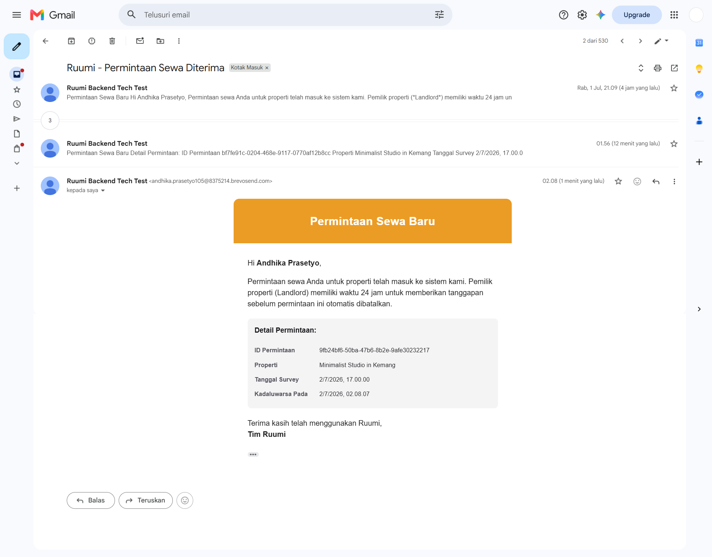
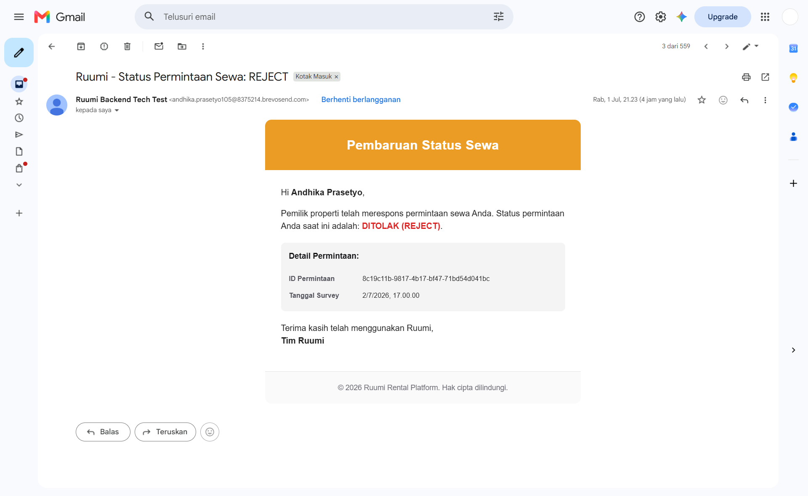
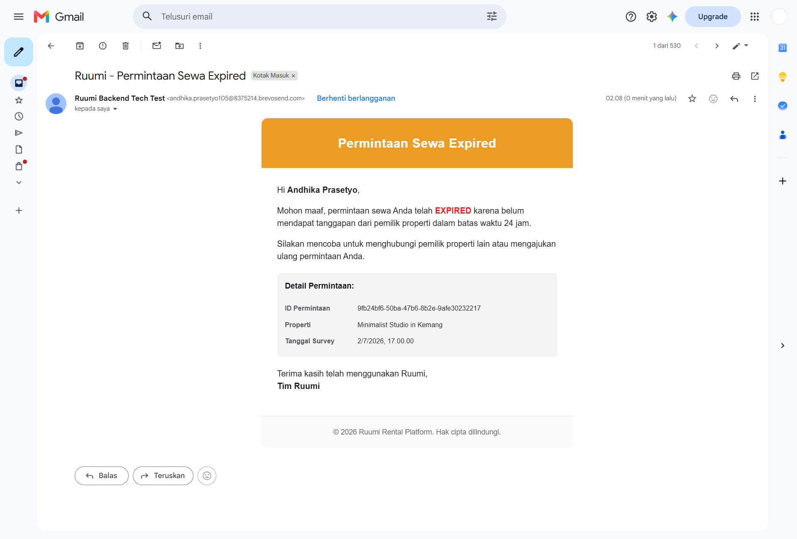

# Ruumi Property Rental - Backend Skill Test

## 🚀 Preparation & Running the Project Locally

This project is built using Node.js (Express), TypeScript, Prisma ORM, PostgreSQL, Redis, and BullMQ.

### Prerequisites

1. **Node.js** (v18+)
2. **Docker Desktop** (to run PostgreSQL and Redis)

### Execution Steps

1. **Run Infrastructure (Docker)**
   Open the terminal in the project root and run:

   ```bash
   docker-compose up -d
   ```

   _This will run PostgreSQL and Redis in docker._

2. **Project Setup (Installation, Migration, Seeding)**
   You can perform this step automatically or manually.

   **Option A: Automatic Setup**

   ```bash
   npm run setup
   ```

   _This command will automatically run `npm install`, Prisma migration, execute data seed, and build TypeScript._

   **Option B: Manual Setup**
   If you want to run it step by step:

   ```bash
   npm install
   npx prisma migrate dev
   npx prisma db seed
   npm run build
   ```

3. **Run the Server**

   ```bash
   npm run dev
   ```

   _The server will run on `http://localhost:3000`. Swagger API Docs can be accessed at `http://localhost:3000/api-docs`._

4. **Run Tests (Testing & Concurrency)**
   ```bash
   npm run test
   ```

---

## Architectural Decisions & Challenge Solutions

This section explicitly explains the architectural strategies I chose to answer the technical specifications of the skill test, along with the trade-offs of other options I considered.

### 1. Challenge A: Overcoming Race Conditions (Concurrency Guard)

**Problem Scenario:**
When many rental requests (`PENDING`) pile up on a popular property, a property owner could accidentally perform a double approval (ACCEPT) action due to a poor connection or a network bug. At worst, if two owners access the application at the exact same millisecond, they could simultaneously change one status to ACCEPT and the other to REJECT, resulting in data inconsistency.

**Strategy Used: _Optimistic Locking_**
To prevent this, the system utilizes an **Optimistic Locking** schema at the database level.
I added a `version` (Integer) column to the `BookingRequest` table. When the landlord wants to PATCH (ACCEPT/REJECT), the flow is:

1. _Service_ checks the version of the current data (e.g., `version = 1`).
2. _Repository_ executes an atomic update query using `updateMany` with two main conditions: `id = ID_BOOKING` **AND** `version = 1`.
3. If the mutation is successful, the `version` column will be incremented `version: { increment: 1 }`.
4. If at the exact same millisecond another HTTP queue tries to respond to the same data, it will still try to update with the condition `version = 1`. However, because the version has been changed to `2` by the first request, the second request's update query **will not find a matching record**, resulting in **0 rows affected**.
5. The _Service_ detecting 0 rows affected directly throws an `HTTP 409 Conflict: Data has been modified by another process` error.

**Why Choose _Optimistic Locking_ Over _Pessimistic Locking_? (Trade-offs)**

- _Pessimistic Locking_ (e.g., `SELECT ... FOR UPDATE` via database transaction) is very safe because it freezes the entire row of data until one request is finished. However, this can trigger **Database Deadlocks** and slow down the application (killing throughput) when user traffic is high.
- _Optimistic Locking_ does not use a lock. It assumes that conflicts rarely happen in the real world. This is **very lightweight and much more friendly to the Database CPU**.
- _Disadvantage (Trade-off):_ If a conflict does occur, the user (or frontend) will receive an error and is required to refresh the data and manually retry the action. I consider this much more reasonable for a Property Rental UX schema compared to letting the user's screen hang due to database table locking.

---

### 2. Challenge B: Auto-Expiration Mechanism (24 Hours)

**Problem Scenario:**
Every new booking request will be given an `expiresAt` exactly 24 hours from when it was created. If the landlord does not answer, the status must change from PENDING to EXPIRED, while simultaneously firing a notification email to the Tenant.

**Strategy Used: _Delayed Message Queue_ (BullMQ + Redis)**
When the POST API successfully creates a booking, I immediately schedule a job to the BullMQ Queue with a delay of exactly `86,400,000` milliseconds (24 Hours).
24 hours later, the worker function will wake up. Using a DB _Transaction_, the worker will check if the status is still `PENDING`. If so, it mutates the status to `EXPIRED` and triggers the Email Queue. If the status is already ACCEPT/REJECT, the worker will gracefully step back and do nothing.

**Why Choose _Delayed Queues_ Over _Cron Scheduler / Opportunistic Lazy Evaluation_? (Trade-offs)**

- **Opportunistic / Lazy Evaluation:** This is a method where the status is not actually changed in the DB; instead, every time the user requests the `GET` API, the code logic evaluates if the date has passed, and then displays it as EXPIRED. Unfortunately, this method cannot answer the system requirement where we must **send an Email message exactly when the data expires**.

- **Cron Schedulers (Poller):** We could create a cron-job that runs every minute checking the contents of the entire table: `SELECT * FROM BookingRequest WHERE expiresAt <= NOW()`. Unfortunately, as data swells to millions of rows, performing massive query scans every minute will only cause the PostgreSQL CPU memory to bottleneck. Furthermore, the execution dispatch is not guaranteed to be accurate to the specific second.

- **Delayed Jobs (BullMQ):** I chose this because of its **Event-Driven** nature. Relying on _Redis ZSET_ behind the scenes, it accurately triggers execution precisely at the required second without the need to constantly pump the database query. The execution mutation is specific to 1 ID only.
- _Disadvantage (Trade-off):_ Requires an additional service (Redis), which increases the complexity of deployment infrastructure, and potentially swells Redis memory if delayed jobs reach millions a day. However, BullMQ offers good optimization for this.

---

### 3. Reliable Asynchronous Emailing: Background Queue Email (_Fault Tolerance_)

I use a separate dedicated queue to handle message delivery (Brevo SMTP via Nodemailer).
With `BullMQ`, the API Controller is able to execute an `HTTP 201 response` to the user in a matter of milliseconds because it merely passes the email payload to Redis. The `email.worker` will then execute the TCP connection to the external mail network. If the Brevo SMTP is down, BullMQ is configured to perform **3 exponential retries** (_Exponential Backoff Retry_), which guarantees system resiliency (_Fault Tolerance_).

---

### 4. Asynchronous Email Verification Evidence

To prove that the background email processing system is working perfectly without blocking the main HTTP thread, here is the evidence:

#### A. Background Worker Execution Logs

Here is the actual log snippet from the server execution. This log indicates that **BullMQ** and **Nodemailer** successfully received the job queue and dispatched the email message behind the scenes:

```text
[EmailWorker] Processing email delivery to: andhika105x@gmail.com
[EmailWorker] Email successfully sent to: andhika105x@gmail.com (MessageId: <78fc450d-be58-08ba-dc67-91ce867af244@gmail.com>)
```

_(As seen from the log, the API finishes its process in milliseconds, while the email queue worker takes over the delivery job afterwards to the Brevo SMTP network.)_

#### B. Inbox Email Screenshots

Here are the visual screenshots of the emails successfully delivered to the tenant's inbox for each booking condition:

1. **New Request Email (PENDING)**
   

2. **Approved Request Email (ACCEPT)**
   

3. **Rejected Request Email (REJECT)**
   

4. **Auto-Expired Request Email (EXPIRED)**
   

---

### 5. Additional Security: Rate Limiting & CORS

To ensure the API is fully prepared for a production environment (_Production-Ready_), I also implemented two industry-standard security layers:

1. **CORS (Cross-Origin Resource Sharing):**
   Allows modern frontends (running on different domains/ports) to securely communicate with this backend without being blocked by strict browser security policies.
2. **Rate Limiting (Anti-DDoS & Brute Force Protection):**
   I implemented `express-rate-limit` at the main application level (`app.ts`). The system restricts the number of API calls to a maximum of **20 requests per 2 minutes** for each IP address. If this limit is exceeded, the user/bot will automatically be blocked and receive a `429 Too Many Requests` response. This is crucial to prevent server abuse (DDoS) and ensure High Availability.

---
